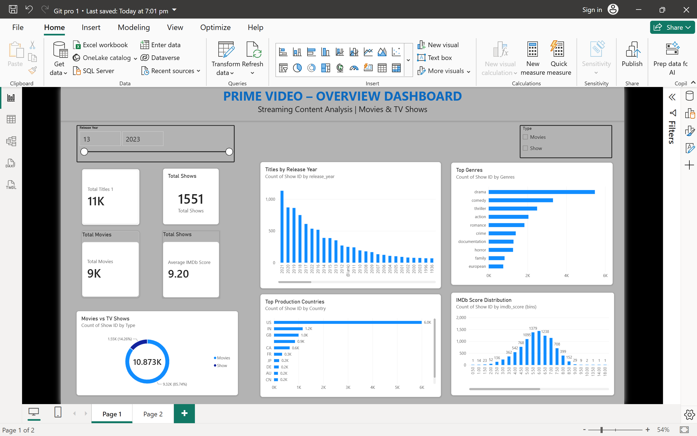
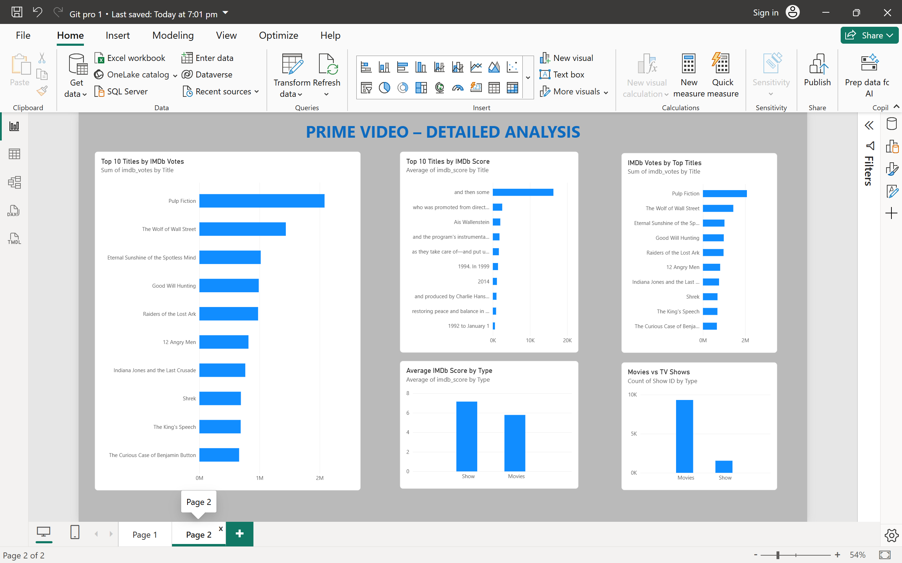

# 🎬 Amazon Prime Video Data Analysis Dashboard

An interactive **Amazon Prime Video Data Analysis Dashboard** developed using **Microsoft Power BI** to explore streaming content, titles, genres, production countries, release years, IMDb ratings, and audience engagement.

## 📊 Dashboard Preview

### Overview Dashboard

### Detailed Analysis

## 🎯 Project Objectives

- Analyze the distribution of Movies and TV Shows.
- Identify the most common genres.
- Analyze content production by country.
- Examine the distribution of IMDb scores.
- Analyze titles by release year.
- Identify titles with high IMDb votes.
- Compare IMDb scores between Movies and TV Shows.

## 📌 Key Dashboard Features

### Page 1 – Overview Dashboard

- Total Titles
- Total Movies
- Total TV Shows
- Average IMDb Score
- Titles by Release Year
- Top Genres
- Top Production Countries
- IMDb Score Distribution
- Movies vs TV Shows
- Interactive filters for Release Year and Content Type

### Page 2 – Detailed Analysis

- Top 10 Titles by IMDb Votes
- Top 10 Titles by IMDb Score
- IMDb Votes by Title
- Average IMDb Score by Content Type
- Movies vs TV Shows comparison

## 🛠️ Tools & Technologies

- Microsoft Power BI Desktop
- Power Query
- DAX
- Data Visualization
- Data Cleaning & Transformation
- Interactive Dashboard Design

## 📂 Project Files

| File | Description |
|---|---|
| `Git pro 1.pbix` | Power BI dashboard file |
| `overview-dashboard.png.png` | Overview dashboard screenshot |
| `detailed-analysis.png.png` | Detailed analysis screenshot |

## 📈 Analysis Areas

The dashboard provides insights into:

- Content type distribution
- Genre popularity
- Production countries
- Release-year trends
- IMDb score distribution
- Audience engagement through IMDb votes
- Movie vs TV Show performance
  
 ## 🔍 Key Insights

Based on the dashboard analysis:

- 🎬 The dataset contains approximately **11K titles**, with Movies forming the majority of the content.
- 📺 TV Shows represent a smaller portion of the overall content library.
- 🎭 **Drama** is among the most frequently represented genres in the dataset.
- 🌎 The **United States** is the leading production country in the dataset.
- ⭐ IMDb scores are concentrated around the **5–7 range**.
- 📈 The number of titles varies significantly across different release years.
- 🏆 Titles such as **Pulp Fiction, The Wolf of Wall Street, and Eternal Sunshine of the Spotless Mind** appear prominently in IMDb-vote analysis.
- 📊 The dashboard allows users to interactively explore the data using **Release Year** and **Content Type** filters.

## 🗂️ Dataset & Data Preparation

The project uses an Amazon Prime Video content dataset containing information about movies and TV shows, including titles, genres, release years, countries, IMDb scores, and IMDb votes.

### Data Preparation

The data was prepared and analyzed using **Power Query in Microsoft Power BI**.

The main preparation steps included:

- Removing unnecessary columns.
- Handling missing and blank values.
- Checking data types.
- Cleaning and standardizing categorical fields.
- Preparing release year and IMDb score fields for analysis.
- Creating relationships between relevant tables.
- Creating calculated measures for dashboard KPIs.
- Organizing the data for interactive visualization.

## 🧮 Power BI Analysis

The dashboard uses Power BI features including:

- **Power Query** – Data cleaning and transformation
- **DAX** – Measures and calculations
- **Slicers** – Interactive filtering
- **Cards** – KPI presentation
- **Bar Charts** – Genre, country and title analysis
- **Donut Chart** – Movies vs TV Shows
- **Column Charts** – Release year and IMDb score analysis

## 📌 Key KPIs

| KPI | Description |
|---|---|
| Total Titles | Total number of titles in the dataset |
| Total Movies | Number of movies |
| Total TV Shows | Number of TV shows |
| Average IMDb Score | Average IMDb score |
| IMDb Votes | Audience engagement based on IMDb votes |

## 👨‍💻 Author

**Parth Desai**

GitHub: [@Parthrd22](https://github.com/Parthrd22)
